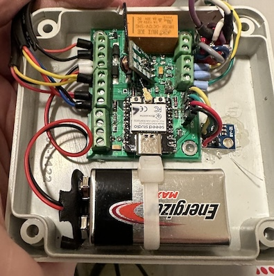
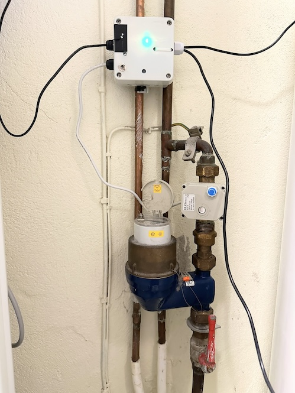
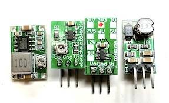

# Ball Valve Controller

A DYI ball valve controller for CR05 wiring based on ESP32c3. This device is mainly intended for irrigation and main water valve automation, but is also very suitable for water leak prevention. For safety, a battery helps make sure the device returns to its default state upon reset or power failure. The device can be directly controlled to the default state by external signals such as a local water leak sensor, or you can use your home automation system to cut off water supply based on more advanced conditions.

The default state can be normally open or normally closed, and is automatically detected on restart. The safety battery voltage is also monitored and available to read remotely.

This board is tested with ESPhome and ESPEasy [firmware](#firmwares) (build instructions below), and is easily used with home automation systems that support MQTT auto discovery, the native Home Assistant API, and the many [controllers that ESPEasy supports](https://espeasy.readthedocs.io/en/latest/Controller/_Controller.html)

## Introduction

Some of the main features and benefits

- **Supports 5-wire CR05 wiring**
    - The true state of the valve can be fed back to your automation system over WiFi
    - You can detect valve malfunctioning
    - Is used by the firmware to automatically detect NO (normally open) or NC (normally closed) operation during startup
- **Supports battery backup and battery status monitoring**
    - A 9V battery is sufficient to make sure the valve returns to it's default state during power failure and resets
    - The battery voltage is readable and available as a sensor
- **Water leak sensors and protection**
    - There are inputs to force the valve to the default state as well as the activated state. Typically used with a Fibaro water leak detector associates with a Fibaro smart implant so that the valve can be "overruled" without any host controller / home automation being involved. Numerous Z-wave and Zigbee devices support this.
- **1-wire support**
    - This is used to attach DS18B20 temperature sensor. I use this with a nearby water heater. Two inputs with pull-ups are available, but you can also use multiple sensors on one wire
- **I2C support**
    - An I2C pin header with power supply is available to use with I2C sensors
    - ... or you can use the same GPIO pins for any other purpose of your choise
- **WiFi based**
    - This is almost a must have for most home automation systems
    - OTA support
    - Configuration backup, restore and bulk updates.
- **Firmware of your choise**
    - ESPEasy with Domoticz over http. Device creation uses virtual sensors
    - ESPEasy with Domotics and Home Assistant via MQTT. Device creation uses a MQTT configuration text file.
    - ESPHome to Home Assistant via MQTT and auto discovery
    - ESPHome to Domoticz via MQTT and auto discovery
    - ... and as the hardware supports using both Arduino and ESP-IF development kits, almost any other firmware can be created.
- **Seed Studio XIAO ESP32C3**
    - This device is shielded and comes with an external IPX antenna connector
    - FCC and CE regulations approved

## Setup and mounting

A typical small electic junction box is used for an easy and affordable way for housing the PCB and battery. These boxes often also support using glands for humidity protection and strain releave.

<p align="center">
    
</p>

Please note the positioning of the battery. The battery can be easily removed to provide room for a USB-C cable connection, in case an OTA update should fail. Failure to OTA is usually recovered by a power cycle, but bugs in OTA libaries need a physical connection for recovery.

The switch (see wiring below) is used to select between normally open and normally closed operation. As the ball valve will return to it's default position during reset, the valve position feedback switches are used to automatically determine if the setup is normally open or normally closed.

One of my permanent setups look like this:

<p align="center">
    
</p>

... where the 1-wire sensors are attached to top and bottom of our electric water boiler.

## Indicators

The 5mm LEDs are suggested to be reverse mounted for the following purposes:

- LED D7 will indicate the state of valve activation - solid on or off
- LED D6
  - will blink with a duty cycle 1-4 or 4-1 to indicate valve closed or open
  - a duty cycle 1:1 will indicate a reset is ongoing
  - no change indicates out of power, device death/freeze or other

## Implementation and design

The easiest way to view the controller is probably this block level wiring diagram:

<p align="center">
    
</p>

This is just a typical setup for the various external components. The schematic diagram is [available here](KiCad/BallValveController-schema-7.0.pdf). The [KiCad EDA](https://www.kicad.org/) project is in the [same folder](./KiCad)


If you use more than one 1-wire sensor, it is easier in ESPHome to use both inputs (RX+TX in diagram) with automatic sensor address detection.

### GPIO pin usage

| PIN      | Capabilty          | Function                            |
|----------|--------------------|-------------------------------------|
| GPIO2    | Active low out     | Activate battery read               |
| GPIO3/A1 | Analog in          | Battery read input                  |
| GPIO4    | Active low in      | Valve open                          |
| GPIO5    | Active low in      | Valve closed                        |
| GPIO6    | I2C                | SDA                                 |
| GPIO7    | I2C                | SCL                                 |
| GPIO9    | Active low out     | Internal status LED                 |
| GPIO10   | Active high out    | Valve activate to non-default state |
| GPIO20   | RX / 1-wire        | Serial or 1-wire sensor             |
| GPIO21   | TX / 1-wire        | Serial or 1-wire sensor             |

### Interfacing leak detectors

J10 is used to interface leak detectors:

| PIN  | Name       | Function                              |
|------|------------|---------------------------------------|
| 1    | Activate   | Pull high to force non-default state  |
| 2    | Deactivate | Battery read input                    |
| 3    | Vcc        | Supply voltage, 3.3V, 5V or 12V strap |
| 4    | GND        | Ground                                |

#### Connecting a Fibaro Implant

A Fibaro implant may be associated with Fibaro leak detector(s). This type of device to device can work even without the Z-Wave hub being operational

- `VCC` - strap JP1 to the 12V supply as illustrated [here](#known-bugs), or just feed the Implant directly from the 12V power supply
- `Deactivate` - connect to one side of Out1 - the other side to GND
- `GND` for implant power and Out1

#### Connecting an Arduino water leak sensor

Typical Arduino water leak detectors are open collector outputs. Connect as follows:

- `VCC` - strap/solder JP1 to the 3.3V side for sensor power 
- `Deactivate` - connect to sensor output. This will force the valve to default state when activated
- `GND` - sensor power ground

## Hardware - getting started

This project uses my [KiCad-lib-ESP32 repository](https://github.com/hansrune/KiCad-lib-ESP32.git) as a [git submodule](https://www.git-scm.com/book/en/v2/Git-Tools-Submodules). To check this out, use the following:

```bash
git clone --recurse-submodules https://github.com/hansrune/BallValveController.git 
```

### Materials used

This project uses the [Seed Studio XIAO ESP32C3 RISC-V module](https://www.seeedstudio.com/Seeed-XIAO-ESP32C3-p-5431.html). This tiny device has proven to be more reliable than most ESP8266 modules used in earlier versions. This module also comes with an IPX connector for connecting an external antenna, and is delivered with a simple external antenna for good range. This device is also EMI shielded and certified.

A ball valve like [these HSH-FLO valves](https://www.ebay.com/itm/121728665101?var=420727385309) uses metal gears, and also have a manual override possibility. Despite the moderate cost, I have found them very reliable. Manufacturer claims 100k operations. I typically use a 2 or some times 3-port version, size 3/4" DN20, DC12/24V and with CR05-01 wiring, including a manual overrride whell option.

Any available 12V DC power supply delivering 1A or more should do.

There are many options and possible pinouts for DC-DC converters for the 12V to 5V conversion. A linear regulator (L7805) will need a heatsink, so a DC-DC converter is recommended.

<p align="center">
    
</p>

The MOSFETs need a low Vgs trigger voltage, i.e. well under 3V on full load. I have used Si2301/A1SHB for the P-channel, and Si2302/N025P for the N-channel, and 2N2222/1P - all SOT-23 packages.

Resistors are 0805 size. Screw terminals are 3.5mm, which is a tight fit when ferrules are being used.

For more information, use [this KiCad BOM](KiCad/BallValveController-BOM.csv)

## Hardware assembly

Soldering a prototype by hand is possible if you have a steady hand and a small solder iron tip. A microscope is recommended to inspect the solder joints properly.

Recommend to do the SMD parts first, then other components. I prefer to mount the 5mm LEDs on the back side.

### Hardware tests

You should test at least the following **before adding the ESP32 module**:

- Attach a battery and check that the valve can be operated both NO and NC
- Add power and check that 5V conversion is OK
- Apply 5V to the ESP32c3 pin 11 to check that the relay is operated
- Apply 0V to pin 1 of the ESP32c3 and check that pin 2 receives a 200ms readout of the battery voltage (divided by the 68k + 20k resistors)

## Firmwares

### ESPHome

ESPHome firmware can be set up from [this ESPHome configuration repository](https://github.com/hansrune/esphome-config) using the `test_ball_valve` as a template

Follow the [README](https://github.com/hansrune/esphome-config) for instructions on what you will likely want to change.

By default, MQTT auto discovery is being used. This should work out of the box with Home Assistant, Domoticz and other that support [Home Assistant MQTT Auto Discovery](https://www.home-assistant.io/integrations/mqtt/#mqtt-discovery)

In Home Assistant, the device has these controls:

<p align="center">
    
</p>

... and information / diagnostics panel:

<p align="center">
    
</p>

### ESPEasy

ESPEasy can be used with a number of different controllers / home automation systms. A custom firmware build description is [available here](https://github.com/hansrune/ESPEasy-custom/blob/builds/custom/mega-20240822-1/README-custombuilds.md)

ESPEasy requires many settings. For configuration settings and rule files, you can upload the files from [this page](./ESPEasy/) as a starting point. Please make sure to change name, unit number, controller IP addresses, NTP, syslog host and latitude/longitude. This configuration uses both a MQTT controller and a Domoticz controller. Change to what you need.

## Bugs and tweaks

### For Fibaro Smart Implants

A Fibaro Smart implant needs a 9-30V power supply. To accomodate that, you can supply 12V by running a wire on the back of the PCB as follows:

<p align="center">
    
</p>

... or just connect to the 12V input terminal

<!-- 

## How to contribute

-->

## License

This project is licensed under the [GNU General Public License v3.0](GNU-LICENSE-V3.txt) for the software, [CERN-OHL-W](OHL-LICENSE.txt) for the hardware, and [CC BY-SA](CC-BY-SA-LICENCE.txt) for the documentation and ideas.

<p align="center" width="100%">
    
</p>

