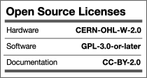

# Ball Valve Controller

Ball valve controller for CR05 wiring based on ESP32c3. Used with ESPEasy and ESPHome based firmware, but Tasmota and alike are certainly also possible. I just don't use any of those


## Introduction

This is my 7th generation ball valve controller which I use to control water supply, plant/garden irrigation, and for water leak protection in remote places over the last 10+ years.

Some of the main features and benefits

- **Supports 5-wire CR05 wiring**
    - The true state of the valve can be fed back
    - You can detect valve malfunctioning
    - Is used by the firmware to automatically detect NO (normally open) or NC (normally closed) operation
- **Supports battery backup and battery status monitoring**
    - A 9V battery is sufficient to make sure the valve returns to it's default state during power failure and resets
    - The battery voltage is readable and available as a sensor
- **Inputs for water leak protection usage**
    - There are inputs to force the valve to default state as well as activated state. Typically used with a Fibaro water leak detector associates with a Fibaro smart implant so that the valve can be "overruled" without any host controller / home automation being involved.
- **1-wire support**
    - This is used to attach DS18B20 temperature sensor if you have a nearby water heater
- **I2C support**
    - An I2C attachment is available to use with I2C sensors - or you can use the same GPIO pins for any purpose og choise
 


## Getting started

This project uses my [KiCad-lib-ESP32 repository](https://github.com/hansrune/KiCad-lib-ESP32.git) as a [git submodule](https://www.git-scm.com/book/en/v2/Git-Tools-Submodules). To check this out, use the following:

```bash
git clone --recurse-submodules https://github.com/hansrune/BallValveController.git 
```

### Materials used

This project uses the [Seed Studio XIAO ESP32C3 RISC-V module](https://www.seeedstudio.com/Seeed-XIAO-ESP32C3-p-5431.html). This tiny device has proven a lot more reliable than any previous ESP8266 module I have used before, and also comes with an IPX connector for the antenna.

A ball valve like [these HSH-FLO valves](https://www.ebay.com/itm/121728665101?var=420727385309) has metal gears as well as manual override possibility, and has proven very reliable. I typically use a 2 or sometimes 3-port version, 3/4" DN20, DC12/24V and with CR05-01 wiring

Any available 12V DC power supply over 1A should do.

There are many options and possible pinouts for DC-DC converters for the 12V to 5V conversion

The MOSFETs need a low Vgs trigger voltage, i.e. well under 2V.

## Assembly

Soldering a prototype by hand is possible if you have a steady hand and a small solder iron tip. A microscope is recommended.

## Known bugs

A Fibaro Smart implant needs a 9-30V power supply. To accomodate that, you can supply 12V by running a wire on the back of the PCB as follows:


## How to contribute

<!-- 
While we try to keep this project open source you are free to make your own choice of materials and adapt the robot to your needs. However, we kindly request you to stick to the suggested 200mm & 300mm 20x20 aluminum extrusions, to allow other users disassemble their current configuration and try out yours! If you use OpenScout for your project, please open a PR with your configuration and tutorials. 

The general process of contributing on GitHub is widely documented however the outline process is below:

1. Identify where you want to host the project locally. This could be a OpenScout projects folder for example. 


1. Clone or fork the repository using GitHub desktop or the CLI into this location (CLI is recommended as this helps you become more familiar with Git in general). You can do this with the following command:

    ```bash
    git clone https://github.com/cbedio/OpenScout
    ```

1. Update the project and then make a pull request!

-->

## License

This project is licensed under the [GNU General Public License v3.0](LICENSE) and [CERN-OHL-W](LICENCE) and [CC BY-SA](CC-BY-SA_LICENCE)

<p align="left" width="100%">
    
</p>

